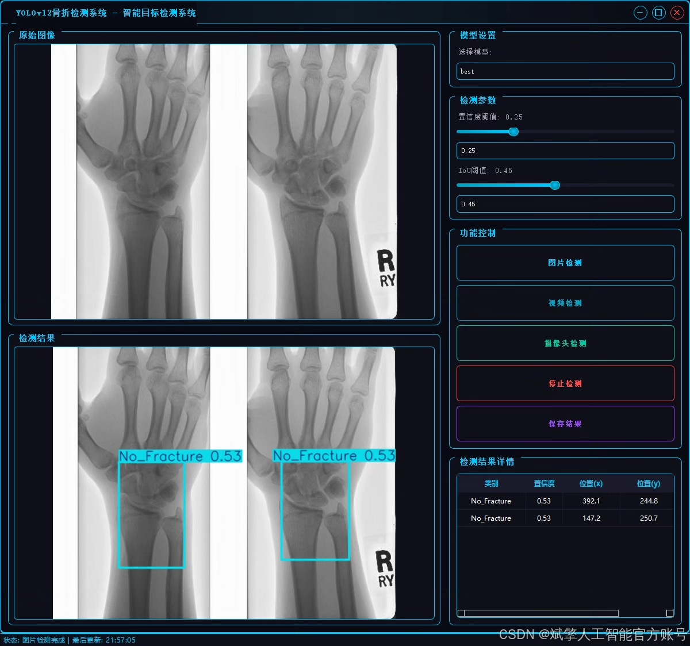
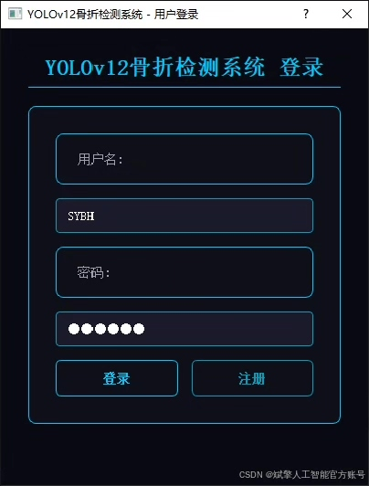
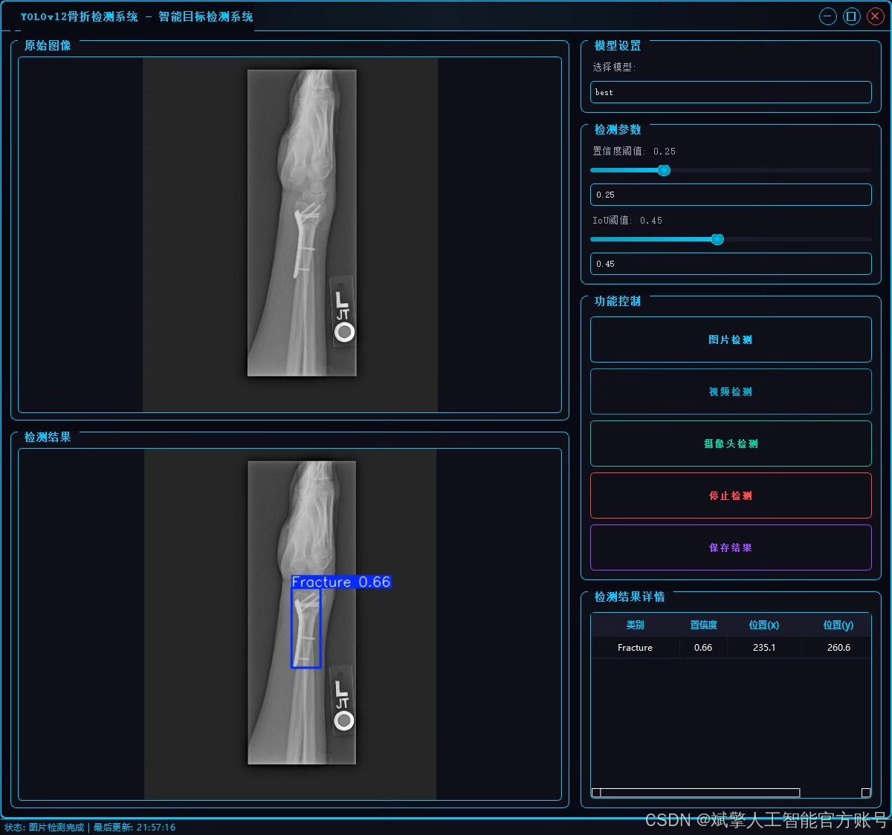
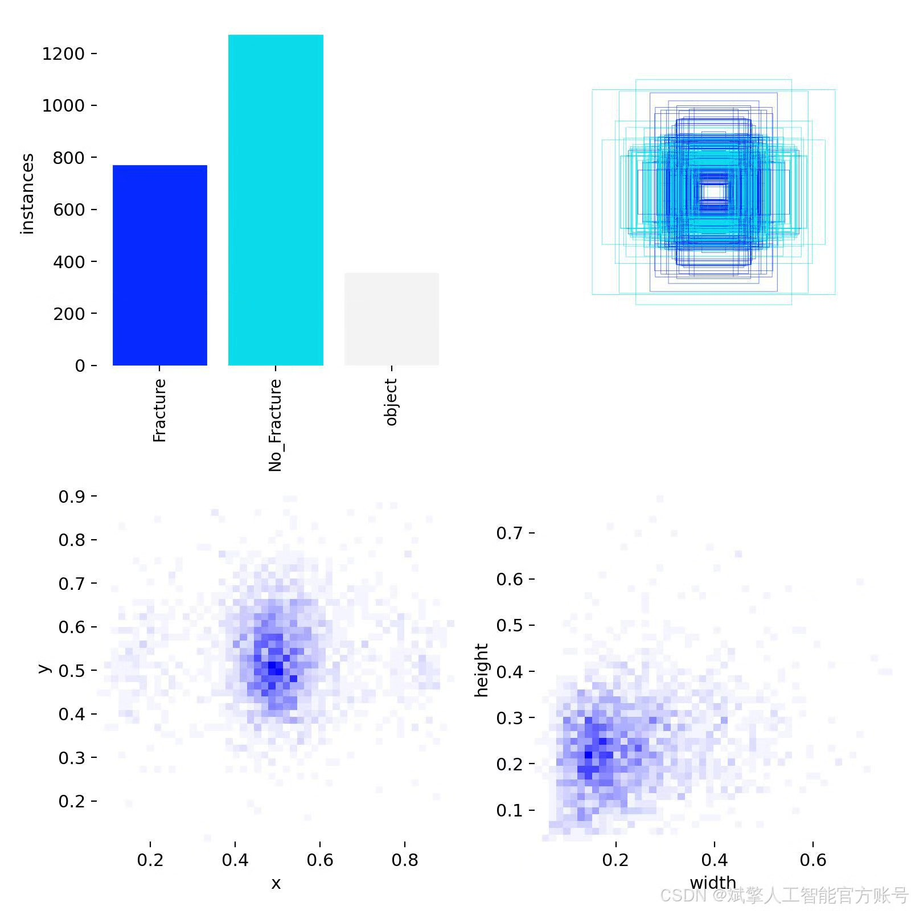
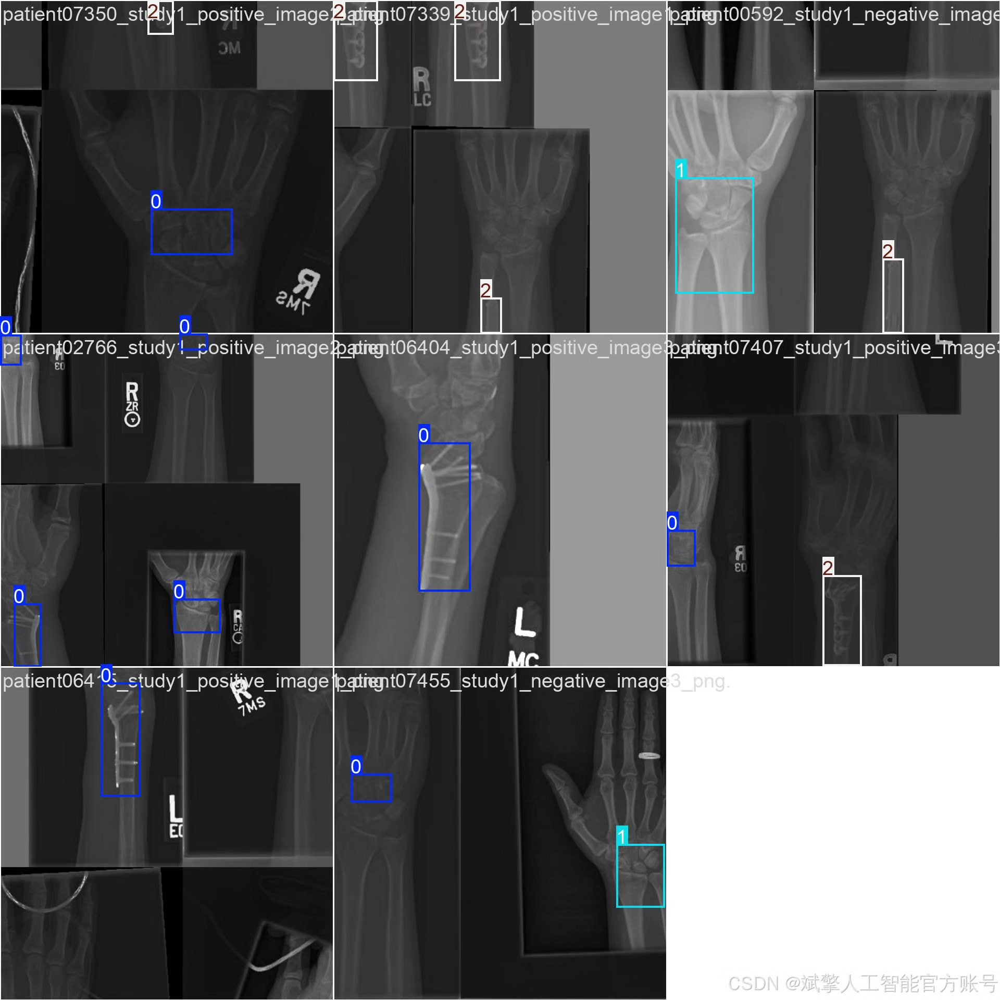
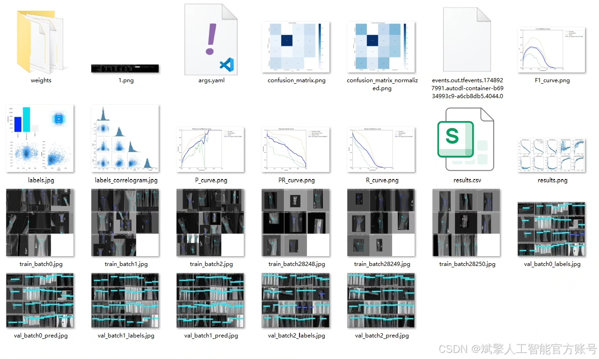
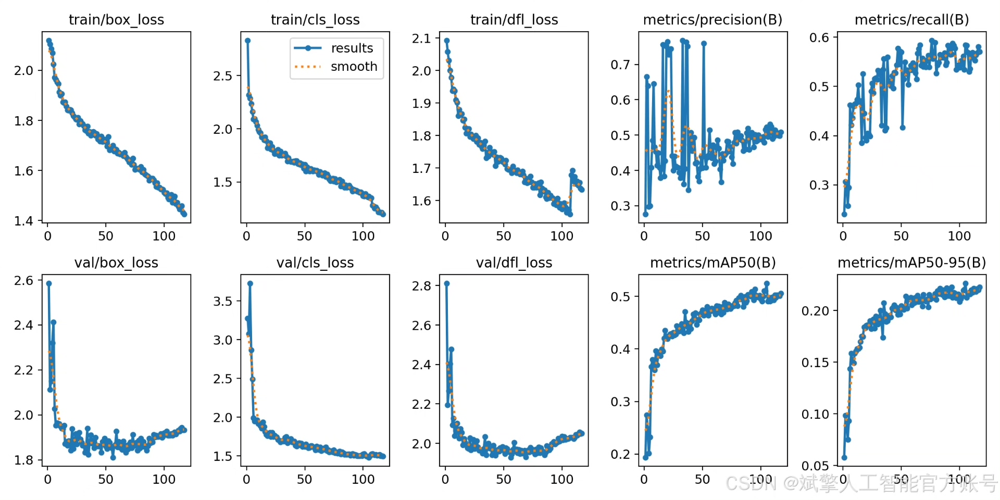
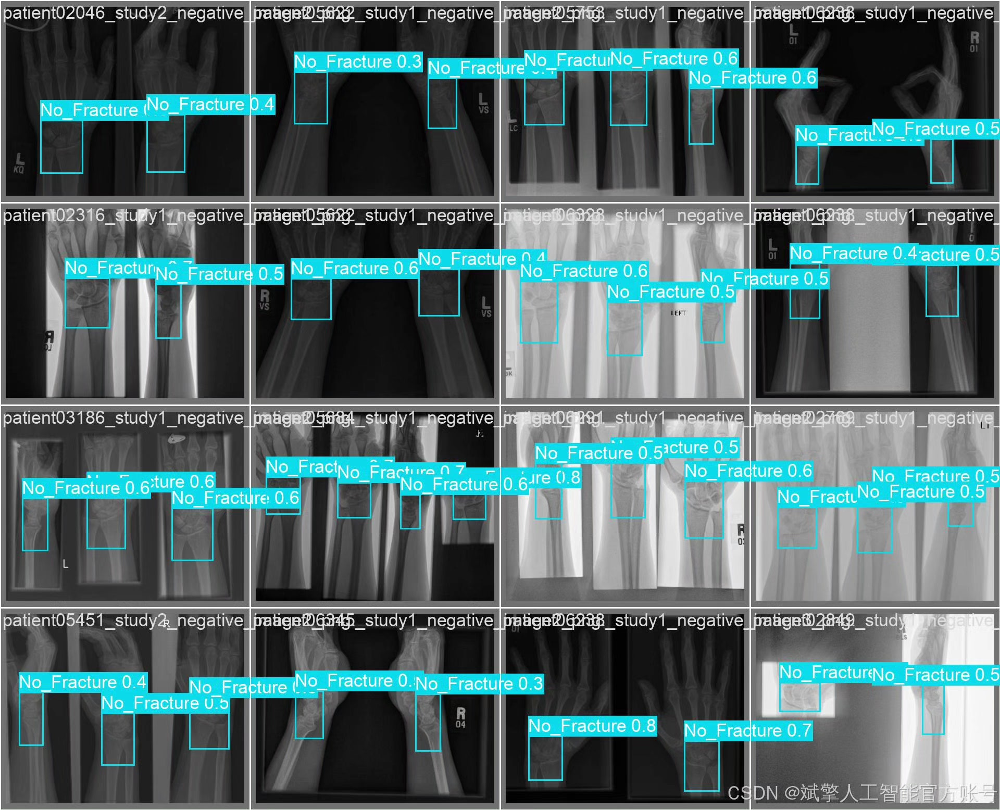

# YOLOv12 Fracture Detection System

## Body

YOLOv12 Fracture Identification System Based on Deep Learning YOLOv12's Fracture Identification Detection System (YOLOv12+YOLO dataset + UI interface + login registration interface + Python project source code + model)

This paper proposes a deep learning-based fracture identification detection system that uses the latest object detection algorithm, YOLOv12, to achieve rapid and accurate localization and classification of fracture lesions. The system recognizes three types of targets: fracture (Fracture), non-fracture (No_Fracture), and other objects (object). It uses a YOLO format dataset containing 2108 training images, 602 validation images, and 301 test images for model training and validation. This system not only has high detection accuracy and real-time performance but also integrates a user-friendly interface (UI), supporting login registration functions, making it convenient for clinical doctors and related technical personnel to operate and use. Experimental results show that the fracture detection system based on YOLOv12 performs excellently in multi-category fracture recognition tasks, helping to enhance the level of intelligence and efficiency in medical image diagnosis.

✅ User Login Registration: Supports password verification and security validation.
✅ Three detection modes: Based on the YOLOv12 model, supports image, video, and real-time camera detection, accurately recognizing targets.
✅ Dual-screen comparison: Displays the original scene and detection results on the same screen.
✅ Data visualization: Real-time table displaying the category, confidence, and coordinates of detected targets.
✅ Intelligent parameter adjustment: Offers a confidence slide bar, dynamically optimizing detection accuracy to meet different scene needs.
✅ Sci-fi style interactive interface: Dark theme combined with dynamic light effects, reducing visual fatigue and improving operational experience.

## Images

## Payment

Here is a pay link on Stripe ( https://buy.stripe.com/3cs8yP7sY87d0vu9AB ). Please contact me lonlonago@foxmail.com after funding $89, and I will send you a complete data files , thank you!

